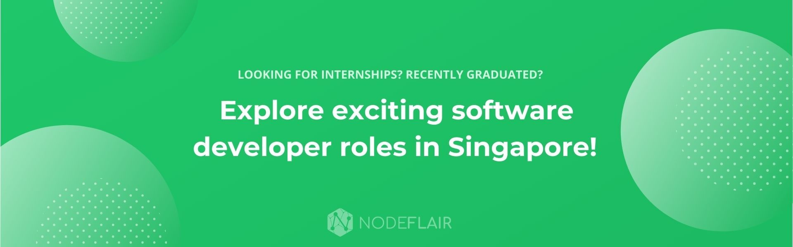

# NTU_CompSci
<b>NTU Computer Science Tutorials, Labs and Assignments</b>

- If there are mistakes / better ways of doing things, do submit a pull request or reach out to me!
- Give me a star if this is useful to you in any way? :)

| Year 1 |                                        |        |
|--------|----------------------------------------|--------|
| CZ1003 | Introduction to Computational Thinking | Python |
| CZ1007 | Data Structure                         | C      |
| CZ1012 | Engineering Mathematics 2              | Python |

| Year 2 |                                                                      |                                                  |
|--------|----------------------------------------------------------------------|--------------------------------------------------|
| CZ2001 | Algorithms                                                           | Python                                           |
| CZ2002 | Object Oriented Design and Programming (OODP)                        | Java, C++                                        |
|        | [MOBLIMA](https://github.com/adriangohjw/cz2002-MOBLIMA)             | Java                                             |
| CZ2003 | Computer Graphics And Visualisation                                  | VRML                                             |
| CZ2004 | Human Computer Interaction (HCI)                                     |                                                  |
| CZ2005 | Operating Systems (OS)                                               | C++                                              |
| CZ2006 | Software Engineering                                                 |                                                  |
|        | [Primus](https://github.com/adriangohjw/cz2006-software-engineering) | Python (Flask), Dart (Flutter)                   |
| CZ2007 | Introduction to Databases                                            | SQL                                              |
| CZ3002 | Software Systems Analysis and Design (SSAD)                          |                                                  |
|        | [Eduventure](https://github.com/adriangohjw/cz3003-eduventure)       | Python (Flask), C# (Unity), JavaScript (ReactJS) |
| CZ3006 | Net Centric Computing                                                | Java, Python                                     |

| Year 3 |                                                                                                           |                                                       |
|--------|-----------------------------------------------------------------------------------------------------------|-------------------------------------------------------|
| CZ3001 | Advanced Computer Architecture                                                                            | CUDA                                                  |
|        | [Project](https://github.com/adriangohjw/cz3001-ACOA)                                                     | Assembly                                              |
| CZ3002 | Advanced Software Engineering                                                                             |                                                       |
|        | [ScanSmart](https://github.com/adriangohjw/cz3002-advanced-software-engineering)                          | Ruby (Ruby on Rails), Android GitHub Actions          |
|        | [MVC Assignment 2](https://github.com/adriangohjw/cz3002-assignment2)                                     | Java (Struts2), Maven, MySQL                          |
| CZ3005 | Artificial Intelligence (AI)                                                                              | Python, Prolog                                        |
| CX4031 | Database System Principles                                                                                |                                                       |
|        | [Project: PICASSO Query Optimizer](https://github.com/adriangohjw/cz4031-DSP-query-optimizer/settings)    | Python                                                |
| CX4153 | Blockchain Technology                                                                                     | C++                                                   |
|        | [aDEX (adriangohjw Decentralized EXchanege)](https://github.com/adriangohjw/cx4153-blockchain-technology) | Solidity, Truffle, JavaScript (Express.js), Bootstrap |

## On a side note...

At [NodeFlair](https://www.nodeflair.com/), I've been working on a new product aimed to disrupt the job search experience as a software developer in Singapore.

If you are looking for software development internships or jobs, feel free to [check it out](http://app.nodeflair.com/explore)! Drop me a message if you have any feedback, I'd love to hear from you!
